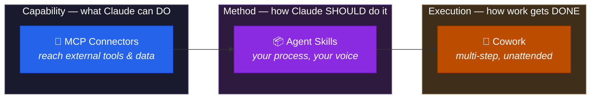
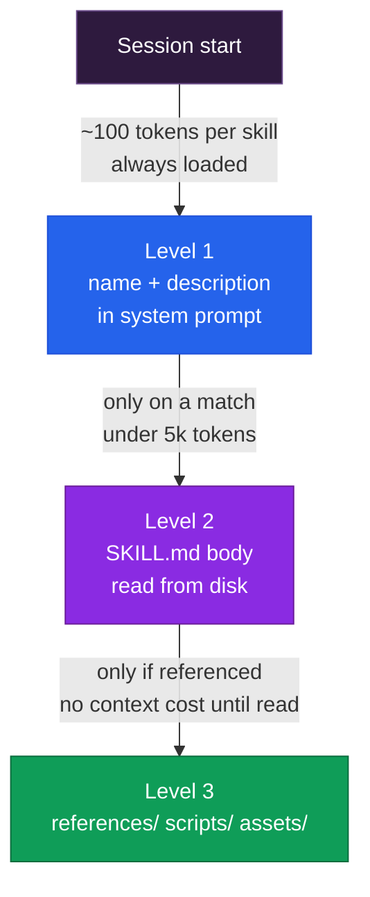

<div align="center">

# 🧠 NextLeap — Claude: MCP, Skills & Cowork

**Three ways to extend Claude beyond the chat box: connect any tool over **MCP**, encode *your* method as a **Skill**, and hand over whole multi-step jobs to **Cowork** — including a full job-search pipeline.**

[](https://claude.com)
[](https://modelcontextprotocol.io)
[](https://agentskills.io)
[](https://claude.com/product/cowork)
[](https://github.com/anthropics/skills)
[](LICENSE)

</div>

---

## 📖 Overview

This session covers three Claude extensibility surfaces that solve three genuinely different problems.

| # | Feature | Solves | Artefact |
| --- | --- | --- | --- |
| 1 | **MCP Connectors** | *"Claude can't reach my tools"* | A URL + OAuth |
| 2 | **Agent Skills** | *"Claude doesn't know how I like things done"* | A folder of instructions |
| 3 | **Cowork** | *"Claude can't finish a 40-step job"* | Just a goal |



Read it as a chain: **connectors** give Claude hands, **skills** give it judgement, **Cowork** gives it the ability to finish the job. Each is useful alone; together they're the difference between a chatbot and a colleague.

---

## 📅 Agenda

| Segment | Duration | Topic |
| --- | --- | --- |
| Claude MCP | ~7 min | Connect tools, call them anytime in chat |
| Claude Skills | ~7 min | Encode "write a PRD my way" |
| Claude Cowork | ~6 min | Automate a job search and apply |

---

## 1️⃣ Claude MCP — Connect Your Tools

MCP (Model Context Protocol) is how Claude reaches tools it wasn't shipped with. Same standard you used in the [n8n MCP workshop](https://github.com/Gursimaran21/NextLeap-Built-MCP-Server-and-Client-04-October-2026) — but here Claude is the client.

### Two entirely different mechanisms

This is the single most confusing part of Claude MCP, so it's worth being precise:

| | **Remote MCP** (connectors) | **Local MCP** (desktop extensions) |
| --- | --- | --- |
| Where it runs | **Anthropic's cloud** | Your machine |
| Added via | Settings → **Connectors** → Add custom connector | `claude_desktop_config.json` |
| Transport | HTTPS (`/sse` = older SSE) | stdio |
| Works in claude.ai / mobile | ✅ | ❌ |
| Works in Cowork | ✅ | ❌ |
| Server must be public | ✅ Required | Local process, no exposure |
| Free plan limit | 1 connector | — |

> ⚠️ **The detail that catches everyone:** for remote connectors, the connection to your MCP
> server originates from **Anthropic's servers**, not your device. Your server must be
> reachable over the public internet. `localhost` will not work, even if it works perfectly
> in your browser. Local `claude_desktop_config.json` servers are a *separate* mechanism and
> don't work in claude.ai or Cowork.

### Connect a remote MCP server

1. **Customize → Connectors** (or **Settings → Connectors** on Desktop)
2. **+ Add → Add custom connector**
3. Enter a **name** and the **HTTPS server URL**, e.g. `https://mcp.example.com/mcp`
4. Review the auth Claude **detected**, and override if needed
5. Choose an authentication model:

   | Option | Behaviour |
   | --- | --- |
   | **Sign in now** | Every user completes the server's OAuth flow before use |
   | **Sign in when needed** | Connects unauthenticated; prompts on demand |
   | **No sign-in** | Anyone with the URL can use it — pair with a request header |

6. Configure the **OAuth client** (hidden when you chose *No sign-in*):
   - **Claude's published identity** *(recommended)* — zero setup, server reads Claude's details from an Anthropic-hosted URL
   - **Register automatically** — Dynamic Client Registration; works with most servers
   - **Use your own OAuth client** — supply your own client ID
7. Optionally add **request headers** for fixed credentials such as an API key
8. **Add**

### Call the tools anytime

Once connected, the tools are available in chat like any other capability:

- Press **`+`** in the chat box → **Connectors** → toggle per conversation
- Set each tool to **Ask each time** / **Always allow** / **Blocked**
- Or enable **Skip approvals** for the whole connector

That per-conversation toggle is the practical answer to "call them anytime" — you can leave a connector switched off for a chatty conversation and flick it on when you need it.

### Pre-built connectors

You don't have to build anything. The **Connectors Directory** at [claude.com/directory](https://claude.com/directory) has ready-made servers for Google Drive, Gmail, Notion, Asana, Canva, Slack, Linear and more. Entries labelled *Made by Anthropic* are first-party; others are community or partner-built, so review auth scopes before connecting anything that matters.

### 🔁 Continuity: connect the n8n MCP server you already built

You built an MCP server two workshops ago. Connect it to Claude:

```text
Settings → Connectors → Add custom connector
Name:    n8n-workflows
URL:     https://<your-n8n-base-url>/mcp/<your-path>
```

That exposes the **Gmail** and **Google Docs** tools from
[NextLeap-Built-MCP-Server-and-Client](https://github.com/Gursimaran21/NextLeap-Built-MCP-Server-and-Client-04-October-2026)
to Claude. Ask it *"send an email summarising today's meetings"* and it uses your own server.

> ⚠️ Two caveats. Your n8n trigger path is effectively a **password** — anyone with the URL can
> call those tools, so keep it out of public places. And **n8n Cloud must be reachable from the
> public internet**, which it is; a self-hosted n8n on your LAN will not be.

---

## 2️⃣ Claude Skills — "Write a PRD My Way"

A Skill is a folder of instructions that teaches Claude **your** process. Not what a PRD is — how *you* write one.

This repo ships a working example: [`skills/prd-writer/`](skills/prd-writer/).

### Anatomy

```text
prd-writer/
├── SKILL.md                      # required — metadata + instructions
└── references/
    └── house-style.md            # loaded only when needed
```

`SKILL.md` is **required**, and the filename is **case-sensitive** — `SKILL.md`, never `skill.md` or `SKILL.MD`.

### Frontmatter

Only two fields are required, but both matter enormously:

```yaml
---
name: prd-writer              # ≤64 chars, kebab-case, no "claude"/"anthropic"
description: Writes a PRD in the user's house style…  # ≤1024 chars, what + when
license: MIT                  # optional
metadata:                     # optional
  author: Gursimaran
  version: 1.0.0
---
```

> ⚠️ **`description` is the whole ballgame.** Claude matches your request against this string and
> nothing else to decide whether to load the skill. It must say **what the skill does** *and*
> **when to use it**. A vague description means a skill that never triggers — the single most
> common Skills mistake.

Constraints worth knowing: no XML angle brackets (`<`, `>`) anywhere in frontmatter, and no
`claude` or `anthropic` in `name` — both are rejected as a security measure, since frontmatter
is injected into the system prompt.

### Progressive disclosure — the core design principle

Skills are three load levels deep. Nothing costs tokens until it's actually needed.



| Level | What | When loaded | Cost |
| --- | --- | --- | --- |
| **1** | `name` + `description` | Always, at startup | ~100 tokens per skill |
| **2** | `SKILL.md` body | When the skill triggers | Target < 5k tokens |
| **3** | `references/`, `scripts/`, `assets/` | Only when Claude reads them | **Zero until accessed** |

This is why you can bundle enormous amounts of reference material — full API docs, schemas,
templates — at no cost. A skill can hold **dozens** of reference files and load one.

Note the asymmetry: **scripts run without entering context.** Only their *output* costs tokens.
So for anything deterministic, write `validate_form.py` rather than asking Claude to re-derive
the validation logic each time.

### Invocation control

| Frontmatter | You can invoke | Claude can invoke | When it loads |
| --- | --- | --- | --- |
| *(default)* | ✅ | ✅ | Description always; body on trigger |
| `disable-model-invocation: true` | ✅ | ❌ | Only when you type it |
| `user-invocable: false` | ❌ | ✅ | Automatically when relevant |

Use `disable-model-invocation: true` for anything with **side effects** — deploy, send, publish.
You don't want Claude deciding to ship because your code looks ready. Use
`user-invocable: false` for background knowledge that isn't an action anyone would type.

### Install it

```bash
# Personal — available in every project
~/.claude/skills/prd-writer/SKILL.md

# Project — committed, shared with the team
.claude/skills/prd-writer/SKILL.md
```

Then either type `/prd-writer`, or just describe a task and let Claude match the description
and load it automatically.

> 💡 **You can also just ask.** Claude can generate a correctly-structured `SKILL.md` for you —
> "create a skill that always writes our weekly status in this format." Best practice is still
> to review and tighten what comes back, particularly the description.

### Authoring rules that actually matter

| Rule | Why |
| --- | --- |
| Description in **third person**, with concrete trigger phrases | Matches how Claude evaluates relevance |
| Body in **imperative** form ("Write X"), not second person | Consistent, unambiguous instructions |
| Keep `SKILL.md` **under 500 lines** (~1,500–2,000 words) | Beyond that, split into `references/` |
| Reference files **one level deep** | Claude may partially read nested references and get truncated content |
| Files over 100 lines get a **table of contents** | Claude may preview with `head -100` instead of reading fully |
| **Forward slashes** in paths | Claude navigates like a filesystem |
| Descriptive filenames | `form_validation_rules.md`, not `doc2.md` |
| Scripts for deterministic operations | Reliability, and saves context |
| No time-sensitive facts in the skill | Skills go stale silently |

> ⚠️ **Cowork doesn't read `~/.claude`.** Cowork loads connectors and skills enabled for your
> claude.ai account via **Customize**, synced at session start. A skill that only exists on your
> local disk works in Claude Code but **not** in Cowork — add it through Customize there.

---

## 3️⃣ Claude Cowork — Automate the Job Search

Cowork brings Claude Code's agentic architecture to non-coding knowledge work. You describe an outcome, step away, and come back to finished files.

### ⚠️ First, the current state of the product

**Cowork and chat merged into one Claude as of late September 2026.** Anthropic stopped making you choose a mode — you just ask for what you need, and Claude decides whether it's a quick answer or a task.

If your message box no longer shows separate **Chat** and **Cowork** options, you already have the new experience. Nothing to enable. Everything below still applies.

This was the right call: people kept starting in one and moving work to the other.

### What makes Cowork different from chat

| | Chat | Cowork |
| --- | --- | --- |
| Access to your files | ❌ You paste | ✅ Reads/writes in folders you grant |
| Multi-step autonomy | Answers one prompt at a time | Plans and executes end to end |
| Sub-agents | No | ✅ Splits work into parallel streams |
| Long-running | No | ✅ Scheduled tasks, cloud-side |
| Browser actions | Limited | ✅ Built-in browser, or Claude in Chrome |
| Output | Text | Excel with live formulas, PowerPoint, formatted docs |

### Requirements

- **Paid plan** — Pro, Max, Team or Enterprise
- **Claude Desktop app** for local file access, browser use and computer use (sessions themselves run in the cloud)
- **Active internet connection** throughout

Sessions run on Anthropic's servers in an isolated environment and follow your account across desktop, web and mobile — so closing your laptop doesn't stop the work.

### The playbook

[`cowork/job-search-playbook.md`](cowork/job-search-playbook.md) is the full thing. The shape:

| Phase | What runs | Output |
| --- | --- | --- |
| **1. Project** | Create a Cowork project + standing `instructions.md` | Persistent criteria, no re-explaining |
| **2. Research** | Discovery run → scoring run → per-company deep dives | `discovery.csv`, `companies/*.md` |
| **3. Tracker** | Claude builds it with live formulas | `tracker.csv` with stage + follow-up dates |
| **4. Apply** | Draft → you edit → fill form → **you** submit | `applications/*.md` |

The key design choice: **research is automated, submission is not.** Claude drafts and fills; you review and press the button.

### The one instruction that makes it work

Put this at the top of your `instructions.md`:

> Tell me what you excluded and why, not only what you included.

It turns each run from something you must audit into something you can spot-check in thirty seconds. That is the difference between automation you trust and automation you babysit.

> ⚠️ **Terms of service.** Most job boards prohibit automated scraping and bulk application.
> Automating *research* is broadly fine. Automating *applications* is where ToS risk lives —
> some sites detect and ban it. Check each board's terms, keep volume human, and never
> misrepresent yourself. Never let a run submit unattended.

### Supported file types

Documents (`.docx` `.doc` `.pdf` `.txt` `.md` `.html` `.json` `.csv` `.tsv`), spreadsheets
(`.xlsx` `.xls` `.xlsm`), presentations (`.pptx`), images (`.jpeg` `.gif` `.svg`), data and
config (`.yaml` `.xml` `.toml`), notebooks (`.ipynb`), and most code files.

---

## 🔐 Security & Permissions

All three surfaces can reach real things. What each gives you:

| Surface | Blast radius | Control |
| --- | --- | --- |
| **MCP connectors** | Whatever the server's tools can do, with your auth | Per-tool Ask / Always allow / Blocked; per-conversation toggle |
| **Skills** | Instructions only — no new permissions | `allowed-tools` (Claude Code only); `disable-model-invocation` for side effects |
| **Cowork** | Folder + tool scope you grant | Approval before significant actions; deletions always need approval |

Cowork's layered protections: **session isolation** (Claude's work runs on Anthropic's servers, separate from your machine and network), **approval gates** before anything significant, and **scope limits** — you choose the folders and tools, so Claude can't reach anything else.

Practical habits:

- Leave **Ask each time** on for anything that writes or sends.
- Only choose **Always allow** for servers you control.
- Turn off connectors you aren't using via the chat `+` menu.
- Block individual tools you don't need under Customize → Connectors.
- Skills don't grant permissions — but the *tools they invoke* do.

---

## 🔧 Troubleshooting

### MCP

| Symptom | Cause | Fix |
| --- | --- | --- |
| Custom connector won't connect | Server isn't public | Must be reachable from the internet; `localhost` fails by design |
| Connection times out | Corporate firewall | Allowlist Anthropic's IP ranges for outbound-only access |
| Server works locally, fails in Claude | Local stdio server | Remote connectors don't use your machine's network |
| Connector missing in Cowork | Configured but not synced | Re-enable under Customize; Cowork ignores `~/.claude` |
| Auth change won't save | Auth is immutable after adding | Remove the connector and re-add it; members must reconnect |
| Wrong auth detected | Server needs non-OAuth | Use **No sign-in** + request headers |
| Custom header rejected | Not on the approved list | Anthropic approves header names; request one via support |
| Server ignores bearer token | Missing scheme prefix | Enter `Bearer TOKEN` including the space |

### Skills

| Symptom | Cause | Fix |
| --- | --- | --- |
| Skill never triggers | Vague `description` | Add concrete trigger phrases and state *when* to use it |
| Skill not found | Wrong filename | Must be exactly `SKILL.md`, case-sensitive |
| Invalid frontmatter | Reserved word or XML tags | No `claude`/`anthropic` in `name`; no `<` or `>` anywhere |
| Works in Claude Code, not Cowork | Cowork doesn't read `~/.claude` | Add via Customize in Cowork |
| Content loads all at once | Progressive disclosure broken | Move detail into `references/`, link one level deep |
| Reads incomplete files | No TOC on a long reference | Add a table of contents above 100 lines |
| Too many skills enabled | Context bloat | Disable what you aren't using; aim well under 20–50 |

### Cowork

| Symptom | Cause | Fix |
| --- | --- | --- |
| Can't read local files | Desktop app not installed/connected | Install and sign in to Claude Desktop |
| Vague progress reports | Task too broad | Split into smaller runs, each producing a file |
| Submits without asking | Missing guardrail | State "do not submit" explicitly every time |
| Browser task stalls | Login or CAPTCHA | Take over in-session, then continue |
| Excluded the wrong companies | Hard filters too strict | Loosen, re-run scoring across the full set |
| Applications sound generic | Voice not specified | Put real sentences in `instructions.md` |
| Lost state between sessions | No project | Use a Cowork project — it persists files and memory |

---

## 📂 Project Structure

```text
NextLeap-Claude-MCP-Skills-and-CoWork-05-October-2026/
├── README.md
├── LICENSE
├── skills/
│   └── prd-writer/
│       ├── SKILL.md                    # the skill — metadata + instructions
│       └── references/
│           └── house-style.md          # loaded only when needed
└── cowork/
    └── job-search-playbook.md          # the full automation playbook
```

### Using the skill

```bash
# copy into your personal skills directory
cp -r skills/prd-writer ~/.claude/skills/

# or into a project
cp -r skills/prd-writer .claude/skills/
```

---

## 🎓 Workshop Context

Part of a **NextLeap AI Engineer bootcamp** series.

| Segment | Duration | Focus |
| --- | --- | --- |
| Claude: MCP, Skills & Cowork | 20 mins | Connectors · Skills · Agentic execution |

### Session map

| # | Repo | Introduced |
| --- | --- | --- |
| 1 | [Google Calendar AI Assistant](https://github.com/Gursimaran21/NextLeap-Google-Calendar-Assistant-04-October-2026) | Single agent + tools |
| 2 | [Build MCP Server and Client](https://github.com/Gursimaran21/NextLeap-Built-MCP-Server-and-Client-04-October-2026) | **MCP** — tools over a standard |
| 3 | [Multi-Agent System — Newsletter Agent](https://github.com/Gursimaran21/NextLeap-Multi-Agent-System-Newsletter-Aagent-04-October-2026) | Multi-agent orchestration |
| 4 | [Building & Sharing n8N Workflows](https://github.com/Gursimaran21/NextLeap-Building-N8N-Workflows-and-sharing-on-Github-04-October-2026) | Building & publishing workflows |
| 5 | [RAG — Pinecone + Gemini](https://github.com/Gursimaran21/NextLeap-RAG-Implementation-Pinecone-Vector-DB-Gemini-Embeddings-05-October-2026) | RAG, embeddings, vector stores |
| 6 | **This repo** | MCP in Claude · Skills · Cowork |

> 💡 **The through-line:** workshop 2 you *built* an MCP server. This session you *consume* one
> — and the same n8n workflow JSON, unchanged, now plugs straight into Claude as a connector.
> That's the payoff of building to a standard.

**Key takeaways:**

- **Connectors give capability, skills give judgement, Cowork gives completion.** Three different problems.
- **Descriptions are prompts.** MCP tool descriptions and skill `description` fields work identically — both are the only text the model matches against.
- **Progressive disclosure is the idea worth stealing.** Load metadata always, instructions on trigger, resources on demand.
- **Automate the research, keep the decisions.** Volume should never outrun your judgement.

---

## 🔗 Resources

- [Claude](https://claude.com) · [Cowork](https://claude.com/product/cowork) · [Connectors Directory](https://claude.com/directory)
- [Custom connectors (remote MCP)](https://claude.com/docs/connectors/custom/remote-mcp)
- [Agent Skills](https://github.com/anthropics/skills) · [Agent Skills spec](https://agentskills.io) · [Skills docs](https://docs.anthropic.com/en/docs/agents-and-tools/agent-skills/overview)
- [Equipping agents with Agent Skills](https://www.anthropic.com/engineering/equipping-agents-for-the-real-world-with-agent-skills) — the design rationale
- [Model Context Protocol](https://modelcontextprotocol.io)
- [Cowork and chat are now one Claude](https://claude.com/blog/cowork-is-now-claude)

---

## 📄 License

Released under the [MIT License](LICENSE).

---

## 👤 Author

**Gursimaran** — [GitHub @Gursimaran21](https://github.com/Gursimaran21)

---

<div align="center">

**Built with 🧠, 🔌 and a folder called `SKILL.md`.**

</div>